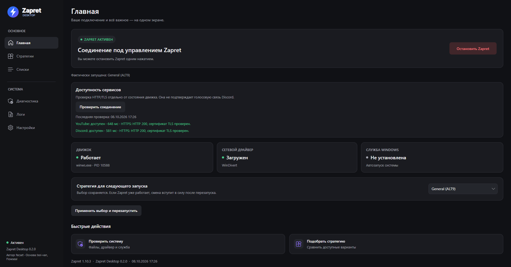

#  Zapret Desktop

**Декстопное приложение для управления Zapret на Windows.** Выбирайте стратегию, проверяйте доступность сервисов, редактируйте списки, сохраняйте резервные копии и устанавливайте обновления в одном приложении.

`Windows 10/11 x64` · `.NET 10` · `Avalonia 12`

Zapret Desktop — проект [fecset](https://github.com/fecset/zapret-desktop). Сетевой движок и стратегии взяты из [Windows-дистрибутива Flowseal](https://github.com/Flowseal/zapret-discord-youtube), основанного на [zapret от bol-van](https://github.com/bol-van/zapret). Интерфейс не заменяет эти компоненты: он управляет их запуском и показывает результат.

## 🖥️ Интерфейс



## ▶️ Первый запуск

1. Откройте [Releases](https://github.com/fecset/zapret-desktop/releases) и скачайте архив для Windows x64.
2. Распакуйте его целиком в отдельную папку. `Zapret.Desktop.exe` должен оставаться рядом с папкой `zapret`.
3. Запустите EXE и подтвердите запрос прав администратора.
4. На главной странице выберите стратегию и нажмите «Запустить Zapret».

Готовый архив содержит .NET, поэтому отдельная установка среды выполнения не нужна.

## 🧩 Как устроено управление

- **Обычный запуск** привязан к текущему экземпляру приложения. Выход через трей останавливает запущенный им `winws.exe`.
- **Служба Windows** запускает Zapret отдельно и может продолжать работать после закрытия окна. Управление службой находится в «Настройках».
- **Внешний запуск** означает, что обнаружен `winws.exe`, которым приложение не управляет. Останавливайте его там, где он был запущен.
- **Выбор стратегии** сохраняется для следующего запуска. Кнопка «Применить выбор и перезапустить» применяет выбранную стратегию и текущие фильтры к процессу или службе.

Запуск и перезапуск службы из настроек применяют выбранную стратегию и текущие диапазоны Game Filter. Перед установкой или запуском службы остановите обычный Zapret; внешний `winws.exe` остановите в приложении, которое его запустило.

В трее показаны текущий статус и выбранная стратегия.

## 🗂️ Где искать нужное

| Задача | Раздел |
| --- | --- |
| Запустить или остановить Zapret, увидеть состояние компонентов | Главная |
| Выбрать `general*.bat`, сравнить стратегии тестом, открыть историю и применить рекомендацию | Стратегии |
| Просмотреть и изменить домены или IP-адреса в конкретном файле | Списки |
| Проверить файлы, права, драйвер, службу, DNS, hosts, proxy и возможные конфликты | Диагностика |
| Посмотреть события и ошибки | Логи |
| Настроить службу, фильтры, автозапуск и тему; резервные копии, payload и обновления | Настройки |

Автоподбор использует тестовый скрипт из дистрибутива Flowseal. Перед тестом остановите работающий `winws.exe` и удалите службу Zapret. Завершённые и отменённые запуски сохраняются в истории вместе со счётчиками и подробным отчётом. Кнопка «Применить рекомендацию» сохраняет выбор для следующего запуска.

На главной странице проверка HTTP/TLS YouTube и Discord показывает результат и время отдельно от состояния `winws`. Успешный HTTP-ответ не подтверждает воспроизведение видео или работу Discord voice.

При выходе во время автоподбора Desktop отменяет тест, дожидается остановки PowerShell и восстанавливает исходный IPSet. После прерванного запуска теста восстановление также выполняется при следующем открытии приложения, до автоматического запуска Zapret. Если резервная копия недоступна, приложение сообщает об ошибке восстановления.

Чтобы Desktop и выбранная стратегия запускались автоматически при входе в Windows, в «Настройках» включите «Запускать приложение вместе с Windows» и «Запускать Zapret при открытии приложения», затем сохраните настройки. Desktop создаёт задачу Планировщика для текущего пользователя с повышенными правами. При первом запуске версии 0.1.3 старая запись автозагрузки переносится автоматически; отдельная настройка запуска стратегии сохраняется. Для запуска Zapret до входа пользователя установите службу Windows.

## 💾 Файлы и пользовательские данные

Приложение читает `zapret/bin`, `zapret/lists`, `zapret/utils`, `service.bat` и файлы `general*.bat`. При редактировании списка меняется выбранный файл в `zapret/lists`. Настройки, история, резервные копии и сохранённые оригиналы payload находятся в `%LOCALAPPDATA%\ZapretDesktop`.

В «Настройках» можно создать копию, экспортировать пользовательские данные в ZIP, импортировать ZIP и восстановить выбранную копию. Архив включает настройки, поддерживаемые списки, фильтры и два ACTIVE payload; перед импортом или восстановлением создаётся копия текущих данных. Хранятся последние 50 исправных копий, история — последние 100 тестов. Заблокированные или повреждённые копии автоматически не удаляются. Импорт не включает автозапуск Windows без отдельного действия пользователя.

Перед первой заменой ACTIVE payload сохраняется исходный файл. Сравнение SHA-256 показывает текущий, выбранный и исходный файл; восстановление оригинала доступно при наличии сохранённой копии. Для файлов, изменённых до версии 0.2.0, исходной копии может не быть.

Обновления сначала загружаются и проверяются, затем устанавливаются отдельной кнопкой. ZIP сверяется с SHA-256 GitHub, проверяются пути, размер, исполняемые файлы и стратегии. Upstream обновляется с копией прежнего каталога и откатом в текущем сеансе; редактируемые списки и payload сохраняются. Desktop обновляет отдельный помощник после закрытия приложения; прежний каталог остаётся рядом с установкой. Запустите новую версию вручную после завершения установки. Пути резервной копии и журнала показаны в логах. Восстановление копии, обновление программы и применение IPSet требуют остановленного движка и службы.

IPSet загружается из фиксированного источника Flowseal и сохраняет текущий режим фильтра. Обновление hosts показывает текущий и предлагаемый текст, применяется только отдельной кнопкой и создаёт резервную копию системного файла. Диагностика системные файлы не изменяет.

Если стратегия не запускается, начните с «Логов», затем запустите «Диагностику». Она помогает различить отсутствие файлов, недостаточные права и проблемы со службой или драйвером. Драйвер WinDivert иногда остаётся загруженным после остановки Zapret — это отдельно показано на главной странице.

## 🛠️ Сборка проекта

Понадобятся Windows x64 и .NET 10 SDK. Папка `zapret` должна сохранять структуру дистрибутива, включённого в репозиторий.

```powershell
dotnet restore ZapretDesktop.slnx
dotnet build ZapretDesktop.slnx -c Release
dotnet test ZapretDesktop.slnx -c Release
```

Для локального запуска используйте `dotnet run --project src/Zapret.Desktop/Zapret.Desktop.csproj`. Устройство решения кратко описано в [ARCHITECTURE.md](ARCHITECTURE.md).

Для релизного ZIP выполните `./scripts/Build-Release.ps1`. Скрипт запускает тесты, публикует автономный EXE, собирает только необходимые файлы движка, добавляет документацию и лицензии, проверяет структуру и создаёт SHA-256. Результат находится в `dist`.

## ⚖️ Лицензирование

Код Zapret Desktop © fecset, [MIT](LICENSE). Авторы исходных проектов — [bol-van](https://github.com/bol-van/zapret) и [Flowseal](https://github.com/Flowseal/zapret-discord-youtube); их уведомление находится в [`zapret/LICENSE.txt`](zapret/LICENSE.txt). WinDivert распространяется по LGPLv3 или GPLv2 на выбор — [текст лицензии](licenses/WinDivert-LICENSE.txt). Сведения об Avalonia, .NET и иконках собраны в [THIRD_PARTY_NOTICES.md](THIRD_PARTY_NOTICES.md). Лицензия интерфейса не меняет условия использования включённых компонентов.
